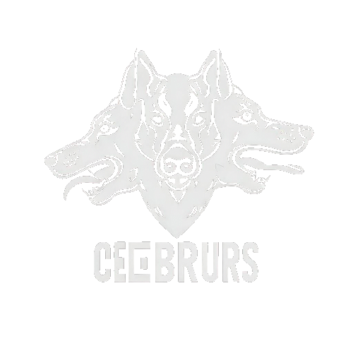
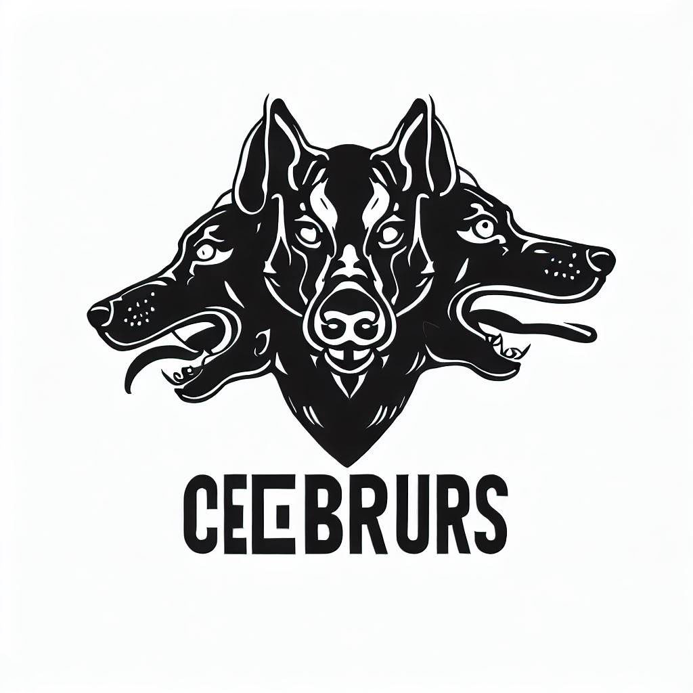

<!-- Improved compatibility of back to top link: See: https://github.com/othneildrew/Best-README-Template/pull/73 -->

<!--
*** Thanks for checking out the Best-README-Template. If you have a suggestion
*** that would make this better, please fork the repo and create a pull request
*** or simply open an issue with the tag "enhancement".
*** Don't forget to give the project a star!
*** Thanks again! Now go create something AMAZING! :D
-->

<!-- PROJECT LOGO -->
 

  

<h3 align="center">Cerberus-Dog-Breed-Classification-and-Body-Localization-PyTorch!</h3>

  

    The goal of the project is to develop a PyTorch-based model capable of recognizing and classifying 3 dog breeds and localizing 3 specific body parts within images.
     
     
     
    <a href="https://Cerberus-Dog-Breed-Classification-and-Body-Localization-PyTorch.tk/">View Demo</a>
    ·
    <a href="https://github.com/gerardocipriano/Cerberus-Dog-Breed-Classification-and-Body-Localization-PyTorch/issues">Report Bug</a>
    ·
    <a href="https://github.com/gerardocipriano/Cerberus-Dog-Breed-Classification-and-Body-Localization-PyTorch/issues">Request Feature</a>
  

<!-- TABLE OF CONTENTS -->

  
Table of Contents

  <ol>
    <li>
      <a href="#about-the-project">About The Project</a>
    </li>
    <li>
      <a href="#getting-started">Getting Started</a>
      <ul>
        <li><a href="#installation">Installation</a></li>
      </ul>
    </li>
    <li><a href="#usage">Usage</a></li>
    <li><a href="#roadmap">Roadmap</a></li>
    <li><a href="#license">License</a></li>
    <li><a href="#contact">Contact</a></li>
  </ol>

<!-- ABOUT THE PROJECT -->

## About The Project

 

  
  

Cerberus is a PyTorch-based project for classifying dog breeds and localizing specific body parts within images. Our model is capable of recognizing and classifying 3 dog breeds (Toy Poodle, Retriever, Beagle, Siberian Husky) and localizing 3 specific body parts (eyes, nose, tail) within images. This repository contains the code and resources for training and evaluating the model, as well as a user interface for interacting with the algorithm.

(<a href="#readme-top">back to top</a>)

<!-- GETTING STARTED -->

### Installation

1. Clone the repo
   ...

(<a href="#readme-top">back to top</a>)

<!-- USAGE EXAMPLES -->

## Usage

.....
....

(<a href="#readme-top">back to top</a>)

<!-- ROADMAP -->

## Roadmap

Mandatory features:

- [ ] Recognizing and classifying 3 dog breeds (Toy Poodle, Retriever, Beagle, Siberian Husky)
- [ ] Localizing 3 specific body parts (eyes, nose, tail)

Optional features:

- [ ] UI

(<a href="#readme-top">back to top</a>)

<!-- LICENSE -->

## License

Distributed under the MIT License. See `LICENSE` for more information.

(<a href="#readme-top">back to top</a>)

<!-- CONTACT -->

## Contact

Gerardo Cipriano - gerardo.cipriano@studio.unibo.it  

Massimiliano Battelli - massimilian.battelli@studio.unibo.it  

Project Link: [https://github.com/gerardocipriano/Cerberus-Dog-Breed-Classification-and-Body-Localization-PyTorch](https://github.com/gerardocipriano/Cerberus-Dog-Breed-Classification-and-Body-Localization-PyTorch)

(<a href="#readme-top">back to top</a>)

<!-- MARKDOWN LINKS & IMAGES -->

[license-url]: https://github.com/gerardocipriano/Cerberus-Dog-Breed-Classification-and-Body-Localization-PyTorchblob/master/LICENSE
[product-screenshot]: res/secondLogo.png
