# Relazione Laboratorio di Ottimizzazione, Intelligenza Artificiale e Machine Learning

# Cerberus

<!-- TABLE OF CONTENTS -->

  
Table of Contents

  <ol>
    <li>
      <a href="introduzione">Introduzione</a>
    </li>
    <li>
      <a href="#classificazione">Classificazione Multiclasse</a>
      <ul>
        <li><a href="#dataset">Dataset</a></li>
        <li><a href="#architettura">Architettura</a></li>
        <li><a href="#addestramento">Addestramento</a></li>
        <li><a href="#valutazione">Valutazione</a></li>
      </ul>
    </li>
    <li>
      <a href="#localizzazione">Localizzazione</a>
      <ul>
        <li><a href="#dataset">Dataset</a></li>
        <li><a href="#architettura">Architettura</a></li>
        <li><a href="#addestramento">Addestramento</a></li>
        <li><a href="#valutazione">Valutazione</a></li>
      </ul>
    </li>
  </ol>

## Introduzione

L'obbiettivo del progetto Cerberus è creare un programma in grado di classificare correttamente 3 razze di cani e riconoscere 3 parti del corpo del cane.

## Classificazione Multiclasse

### Introduzione

La classificazione in Cerberus ha lo scopo di identificare, partendo dall'immagine di un cane, se questo appartiene ad una di queste tre razze: Husky Siberiano, Beagle e Barboncino Toy.
Per raggiungere questo obiettivo, è stata creata una GUI per consentire all’utente l’accesso a tutte le funzionalità di addestramento e previsione.
Il codice utilizza principalmente le librerie PyTorch e torchvision per implementare il modello di classificazione delle immagini e per gestire i dati di addestramento. Inoltre, viene utilizzata la libreria TensorBoard per monitorare le prestazioni del modello durante l’addestramento.
La maggior parte degli iperparametri è configurabile attraverso il file config.json.
Le classi sono suddivise in più file e ciascuna di queste ha un compito ben preciso per garantire la modularità del codice.

- main.py: entry point dell'applicazione cerberus;
- user_interface.py: istanzia la GUI;
- data_model_manager.py: crea i dataloader, si occupa di creare gli oggetti NetRunner, Predictor e CatTrainer e di passargli tutte i parametri necessari.
- net_runner.py: questa classe gestisce l’addestramento e la valutazione del modello di classificazione delle immagini. Ha metodi per caricare il modello, eseguire l’addestramento e valutare le prestazioni del modello sul set di validazione e sul set di test. Inoltre, utilizza TensorBoard per monitorare le prestazioni del modello durante l’addestramento.
- prediction.py: implementa un predittore che utilizza il modello addestrato per classificare le immagini. Ha metodi per caricare il modello e per eseguire la predizione su un’immagine fornita dall’utente.
- cat_trainer.py: usa il modello preaddestrato su razze di cani scongelandone i pesi e esegue il train su foto di gatti; l'addestramento non sovrascrive i pesi pre esistenti, ha il compito di valutare come si comporta il modello usando un altro dataset e cambiando leggermente il problema sulla quale era stato trainato prima.

    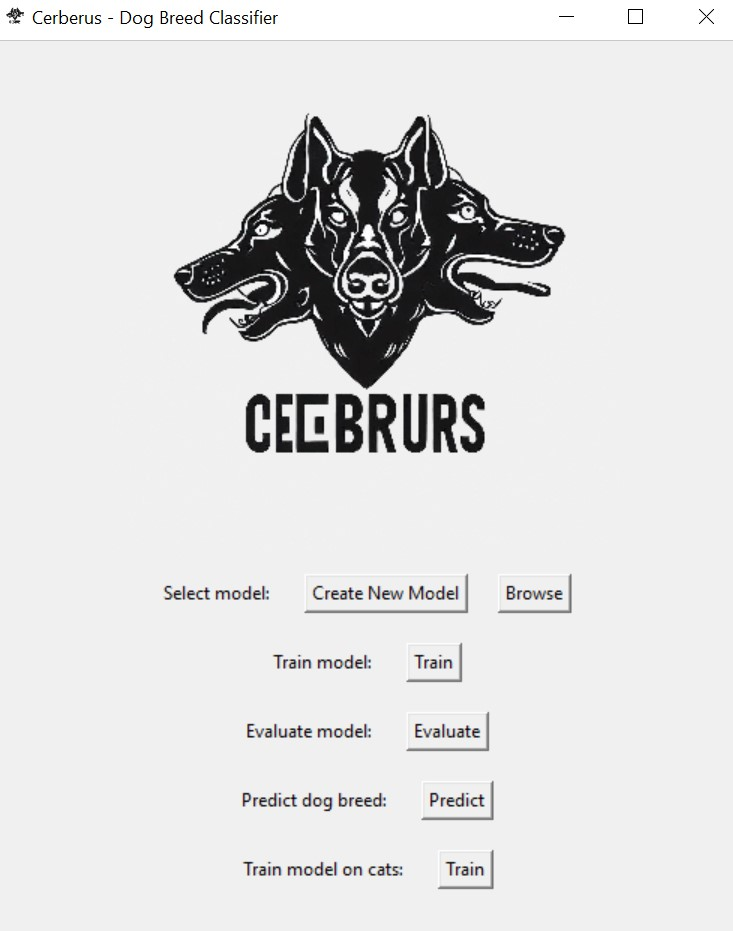

 

### Scelta del dataset

Il codice utilizza due dataset per addestrare il modello: il dataset Stanford Dog e il dataset Kaggle Breeds Cat. Questi due dataset sono stati scelti perché contengono un gran numero di immagini di cani e gatti di diverse razze, il che li rende adatti per addestrare un modello di classificazione delle immagini in grado di riconoscere le diverse razze di cani e gatti.

Per gestire i dati di addestramento, il codice utilizza due DataLoader personalizzati. Un DataLoader è un’interfaccia fornita dalla libreria PyTorch che consente di caricare i dati in modo efficiente durante l’addestramento del modello. In questo caso, i dati vengono suddivisi in tre set: train (80%, 136 immagini), validation (10%, 29 immagini) e test(10%, 29 immagini). Il set di train viene utilizzato per addestrare il modello, il set di validation viene utilizzato per valutare le prestazioni del modello durante l’addestramento e il set di test viene utilizzato per valutare le prestazioni del modello dopo l’addestramento. Il numero di immagini è bilanciato fra le tre classi, per cui non c'è n'è una con un numero maggiore rispetto alle altre. Ho notato che AlexNet riusciva ad addestrarsi bene anche con un numero inferiore di immagini, per cui ho eseguito l'undersampling manuale delle classi finchè non ho ottenuto lo stesso numero per tutte.

Il dataset che contiene le razze dei gatti è stato volutamente sottodimensionato (20 immagini per il train, 5 per val e test) per poter sperimentare se il modello pre addestrato con le razze dei cani raggiungesse la convergenza in tempi e con risorse minori.

Non è stato necessario utilizzare la data augmentation perchè il modello si è dimostrato in grado di raggiungere una buona affidabilità anche solo con le immagini prese dal dataset di partenza.

### Scelta dell’architettura

L’architettura scelta per il modello è AlexNet. Questa scelta è stata fatta perché AlexNet è una rete neurale convoluzionale che ha dimostrato di essere molto efficace nella classificazione delle immagini. Inoltre, AlexNet è stata progettata per essere facilmente adattabile a nuovi compiti di classificazione, il che la rende una scelta ideale per questo progetto. Inoltre è utilizzabile facilmente utilizzando direttamente la libreria models di pytorch e non richiede grandi performance per essere addestrata.

Per addestrare il modello, viene utilizzata la funzione di perdita CrossEntropyLoss e l’algoritmo di ottimizzazione SGD (Stochastic Gradient Descent) con un tasso di apprendimento e un momento specificati nella configurazione. La funzione di perdita CrossEntropyLoss è una scelta comune per i compiti di classificazione multiclasse perché misura la distanza tra le previsioni del modello e le etichette vere. L’algoritmo SGD è un metodo efficace per ottimizzare i pesi del modello durante l’addestramento.

### Addestramento

Il modello viene addestrato in due fasi. Nella prima fase, viene eseguito il transfer learning sul dataset dei cani congelando i pesi del modello preaddestrato di AlexNet. In questo modo, il modello può imparare a riconoscere le diverse razze di cani senza dover riaddestrare tutti i pesi della rete.

Nella seconda fase, viene eseguito l’addestramento sul dataset dei gatti scongelando i pesi del modello. In questo modo, il modello può utilizzare ciò che ha imparato durante l’addestramento sulle razze dei cani anche per riconoscere le razze dei gatti.

Durante l’addestramento, vengono calcolate la perdita e l’accuratezza sul set di train e sul set di validation e vengono registrate su TensorBoard per consentire un facile monitoraggio delle prestazioni del modello durante l’addestramento; Inoltre, vengono registrati su TensorBoard anche gli embeddings, il primo batch di immagini per ogni epoca e le matrici di confusione per il set di train e il set di validation.

In ciascuna fase, è presente un contatore che consente l'early stopping in caso l'addestramento non stia migliorando significativamente col passare delle epoche in modo da evitare così l'overfitting.

### Valutazione

Durante l’addestramento sulle razze di cani, il modello ha mostrato un miglioramento costante nella precisione di validazione, raggiungendo già una buona verso l'epoca 5. Durante l’addestramento sulle razze di gatti, il modello ha mostrato un miglioramento rapido nella precisione di validazione, raggiungendo una precisione molto alta all’epoca 2 e mantenendo una precisione del 100% per le altre epoche. L’addestramento si è interrotto anticipatamente dopo 3 epoche senza miglioramenti.
Nel complesso, il modello sembra aver raggiunto una buona precisione sia per le razze di cani che per quelle di gatti.

    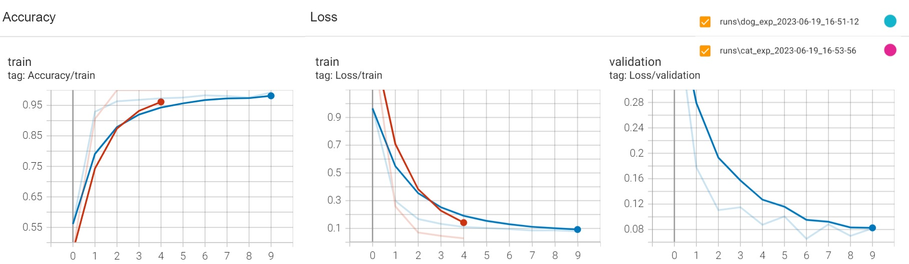

 

Durante l’addestramento sulle razze di cani, ho provato a variare il numero di batch, i risultati dell'immagine precedente mostrano un addestramento su batch di 32 immagini, qui invece il grafico dell'andamento con batch di sole 4 immagini. Come si evince dal grafico il modello converge rapidamente anche con questa modifica. In tutti e due i test la convergenza viene ottenuta prima di 10 epoche, per cui considerando che ho anche l'early stopping configurato, non ho ritenuto rilevante modificare anche il numero di epoche, poichè quasi sempre il modello raggiunge in 5/6 epoche un livello accettabile di accurancy.

    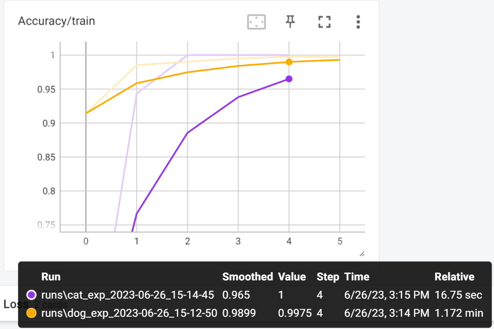

 

Salvando gli embeddings durante l’addestramento delle razze di cani, è possibile visualizzare una rappresentazione bidimensionale o tridimensionale dei dati di input nel projector di TensorFlow. Gli embeddings sono vettori di numeri che rappresentano i dati in uno spazio a più dimensioni e possono essere utilizzati per visualizzare le relazioni tra i dati. Il projector di TensorFlow consente di esplorare questi embeddings e vedere come i dati sono raggruppati o separati nello spazio degli embeddings. In questo caso, si possono identificare tre grandi aree, anche se un po’ troppo ravvicinate fra loro, una per ciascuna razza.

    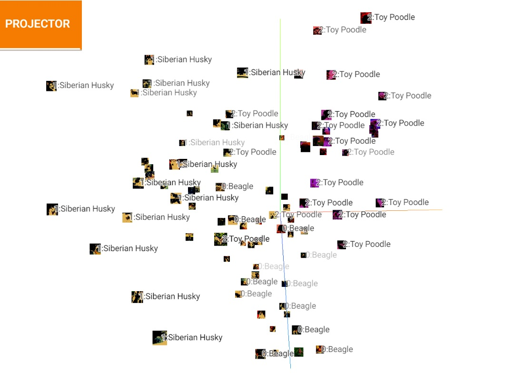

 

## Rilevamento Degli Oggetti

### Introduzione

L'object detection di Cerberus consiste nel localizzare all'interno di immagini di cani 3 parti del corpo:
occhi, naso, coda. Il software mette a disposizione una interfaccia dalla quale l'utente può caricare un immagine,
eseguire la detection e visualizzarne il risultato con le bounding boxes associate.
Il software è contenuto nella directory Object-detection composto dai seguenti file:

- create.ipynb: jupyter notebook con le istruzioni per il caricamento del dataset, allenamento
  del modello, validazione, e testing, usato durante lo sviluppo.
- main.py: entry point dell'applicazione.
- model.py: classe che rappresenta il modello.
- user_interface.py: definisce l'interfaccia utente e importa il modello.
- ./Cerberus: contiene i 3 modelli addestrati in fase di progettazione.
- ./yolov5: contiente il modello yolov5 di ultralitycs.
- ./yolov5/Cerberus-10, ./yolov5//Cerberus-12: 2 versioni del dataset usato per l'addestramento, la versione 12 è
la più recente.

    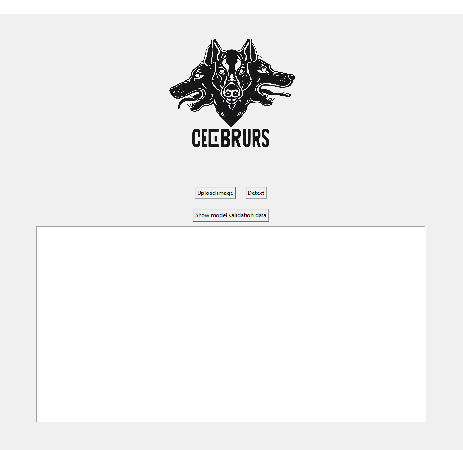

 

### Preparazione Dataset

Le immagini sono state prese dal dataset [Stanford Dogs](https://www.kaggle.com/datasets/jessicali9530/stanford-dogs-dataset)
in particolare le razze: Beagle, Siberian Husky, Toy Poodle.
Inizialmente sono state caricate su [Roboflow](https://roboflow.com/), tool per facilitare i task su progetti di computer vision.
Alle immagini sono stati eseguiti dei processi:

- Aggiunta manuale delle annotazioni per parte del corpo.
- Preprocessing:
  - Auto-orient: step per l'orientamento automatico dell'immagine
  - Ridimensionamento in 640x640 per aumentare la velocità di training
- Augmentation: modifiche aggiuntive alle immagini per aumentare e variare il dataset:
  - Flip orizzontale e verticale
  - Rotazione 90°
  - Rotazione -15° +15\*
  - Ritaglio
  - Hue, Saturation, Brightness
  - Offuscamento
  - Rumore
- Generate: Roboflow genera automaticamente nuove immagini con le modifiche definite prima.

Questo genera una nuova versione del dataset che poi verrà usata nel training.

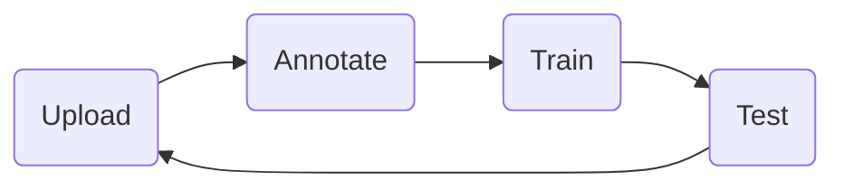

### Addestramenti e considerazioni

#### Primo addestramento:

E' stato eseguito il training della versione 10 del dataset (./yolov5/Cerberus-10),
che conteneva 75 immagini e nessun processo di data augmentation. 
**epoche:** 50 
**batch size:** 8 

    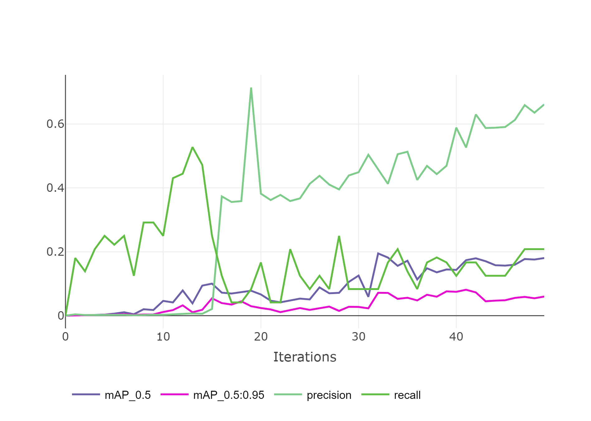
    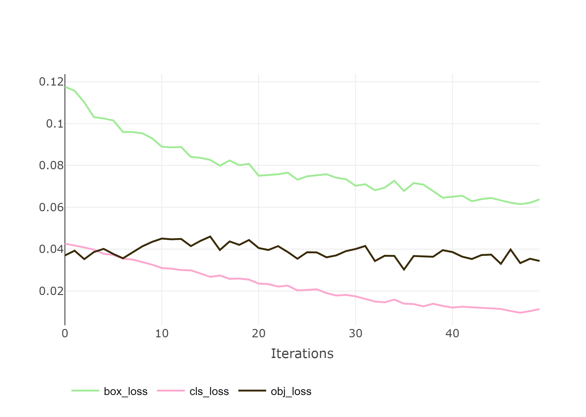

 
<pre>
  Metriche di valutazione: 
  Validating Cerberus\training_1\weights\best.pt...
  Model summary: 157 layers, 7018216 parameters, 0 gradients, 15.8 GFLOPs
                   Class     Images  Instances          P          R      mAP50   mAP50-95: 100%|██████████| 1/1 [00:02<00:00,  2.16s/it]
                     all          6         22      0.527      0.167      0.173     0.0812
                       0          6          8      0.239       0.25      0.224      0.143
                       1          6          8      0.342       0.25      0.216     0.0605
</pre>                    
Da come si vede nella valutazione i valori di Precision, Recall, mAP50, mAP50-95 risultano molto bassi, non sufficienti per 
il funzionamento corretti del modello.

#### Secondo addestramento:

Per migliorare la qualità del modello si è deciso di modificare per prima cosa il dataset, è stata generata
una nuova versione (./yolov5/Cerberus-12) aggiungendo 30 immagini con annotazioni e moltiplicando la dimensione
del dataset per 3, grazie ai processi di data augmentation di roboflow, avendo così un totale di 300 immagini. 
**epoche:** 50 
**batch size:** 8 

    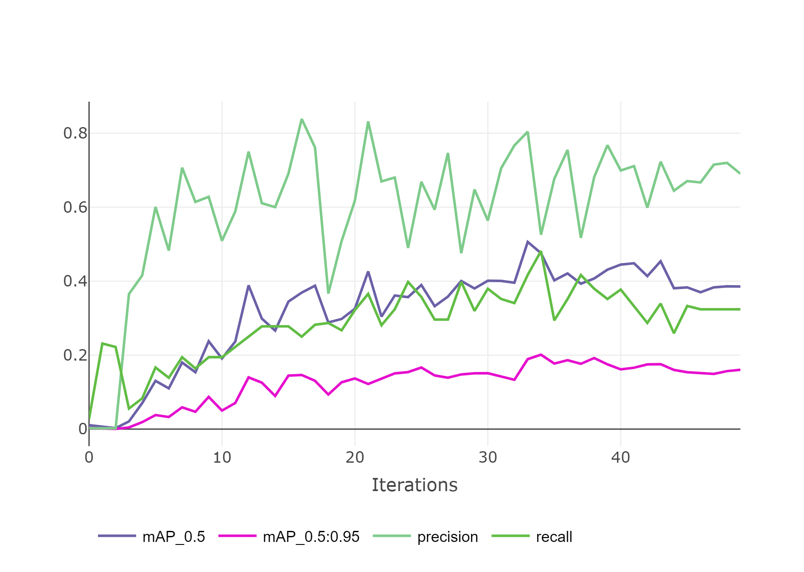
    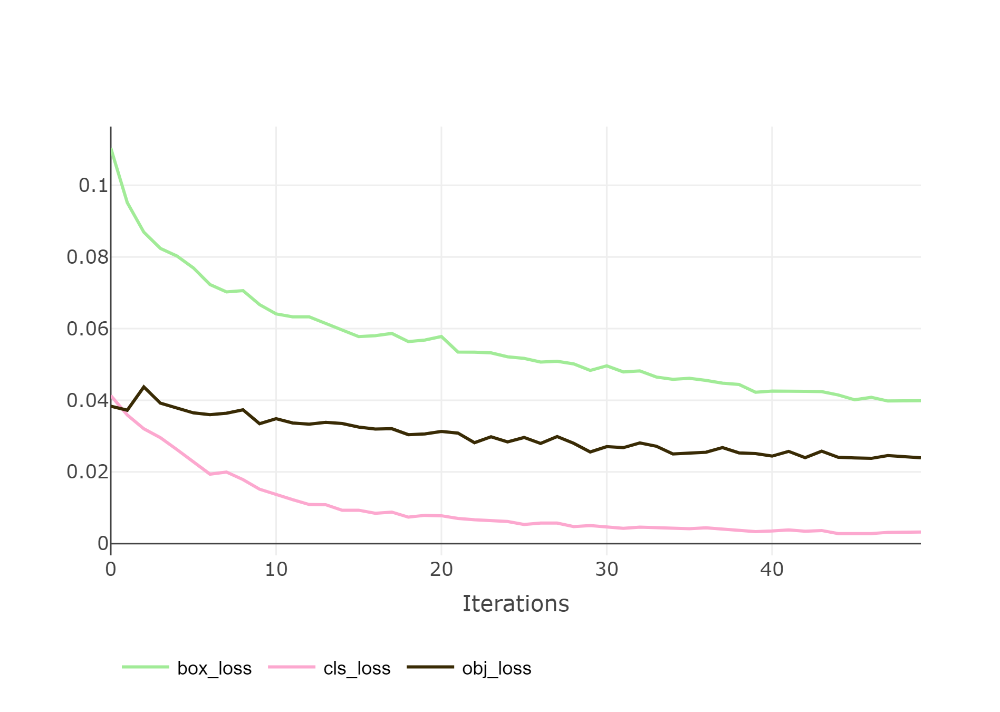

 
<pre>
  Metriche di valutazione: 
  Validating Cerberus\training_2\weights\best.pt...
  Model summary: 157 layers, 7018216 parameters, 0 gradients, 15.8 GFLOPs
                   Class     Images  Instances          P          R      mAP50   mAP50-95: 100%|██████████| 1/1 [00:13<00:00, 13.69s/it]
                     all         10         33      0.524      0.481      0.476      0.201
                       0         10         12      0.254      0.417      0.275     0.0824
                       1         10         12       0.41      0.583      0.604       0.29
                       2         10          9      0.909      0.444      0.549      0.232
</pre>
I valori sono risultati migliori di quelli precedenti.

#### Terzo addestramento:

Pur ottenendo dei valori abbastanza soddisfacenti ho notato che le training loss curves continuavano a diminuire leggermente, mentre
le validation loss rimanevano le stesse raggiunta epoca 30. Dalle mie ricerche questo fenomeno avrebbe potuto portare a un overfitting, così
per provare a trovare un soluzione ho deciso di rieseguire il training diminuendo le epoche, e aumentanto il batch size per diminuire
il tempo di training, visto che ci metteva troppo. 
**epochs:** 25 
**batch_size:** 12 

    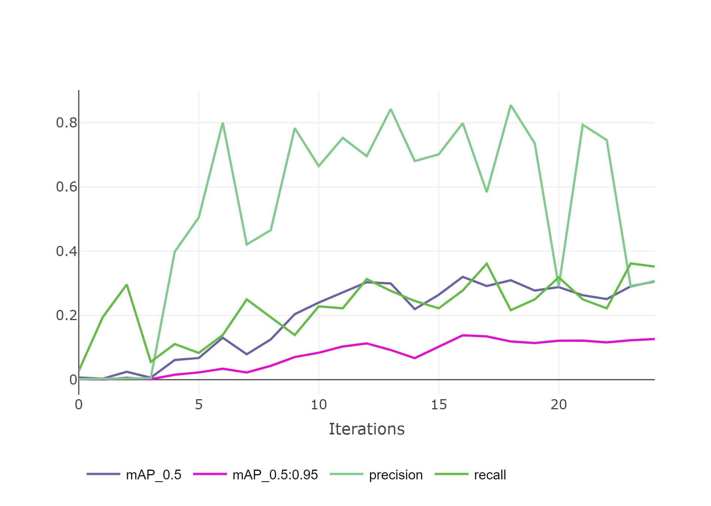
    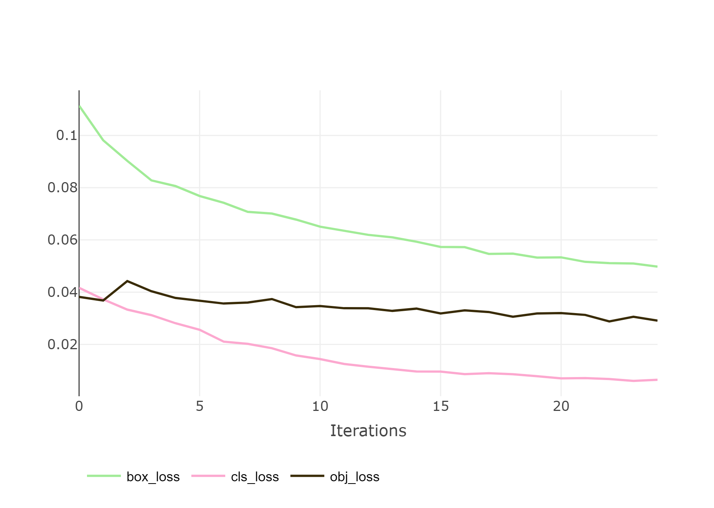

 
<pre>
  Metriche di valutazione: 
  Validating Cerberus\training_3\weights\best.pt...
  Model summary: 157 layers, 7018216 parameters, 0 gradients, 15.8 GFLOPs
                   Class     Images  Instances          P          R      mAP50   mAP50-95: 100%|██████████| 1/1 [00:03<00:00,  3.63s/it]
                     all         10         33      0.798      0.278      0.325      0.141
                       0         10         12      0.544      0.333      0.266     0.0674
                       1         10         12      0.849        0.5      0.543      0.263
                       2         10          9          1          0      0.166      0.094
</pre>                     
La Precision è risultata molto migliore, ma gli altri 3 valori (R, mAP50, mAP50-95) sono diminuiti.
Dopo qualche test manuale del modello ho deciso di mantenere l'addestramento 2 che mi pareva avere 
risultati migliori.

### Considerazioni finali

Il modello ottenuto non è perfetto e genera qualche errore di localizzazione, soprattutto nel localizzare la coda,
probabilmente dovuto al fatto che non tutte le immagini del dataset la mostravano, tuttavia la maggiorparte delle volte
riesce a localizzare le parti del corpo nei punti giusti. Nel caso volessi migliorarne la qualità ancora, il primo step
sarebbe quello di aumentare il numero delle immagini del dataset con annotazioni aggiunte manulamente, e poi successivamente
lavorare con le epoche, batch size, e iperparametri.

Se guardiamo al lavoro svolto sia alla Classificazione che alla Localizzazione, possiamo riassumere il grafico dei vari layer utilizzati nella seguente figura:

    

